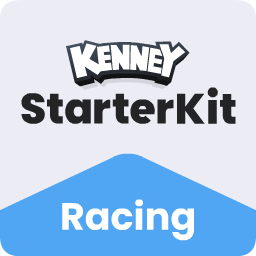
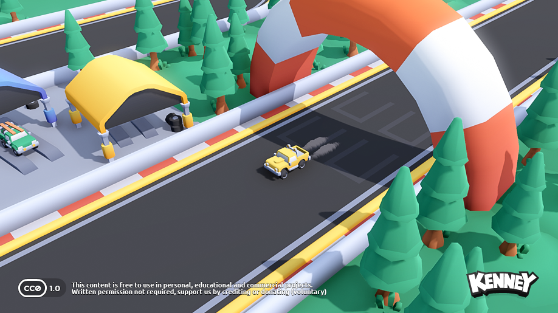

# Little Toy Garage

A tablet-friendly photo garage and 180 × 180 city driving playground built on Kenney Starter Kit Racing (Godot 4.6).

## Photo to playable car

Take or choose a photo, choose the closest of four car shapes (or the custom Challenger Drift preset), and pick the paint color. A saturated color from the center of the photo is suggested; tap the paint in the photo to correct it. The image remains on the garage card and driving HUD. This is a similar 3D car, not automatic 3D reconstruction or automatic shape recognition.

Photos are resized to at most 720 pixels, converted to JPEG, and saved with the car settings in browser local storage. There is no photo upload or paid AI service. Each browser/device has its own garage; clearing browser storage removes it. Large/unreadable images and unavailable storage show a message.

## Free hosting and updates

GitHub Pages deployment is configured in .github/workflows/deploy.yml. It uses official Godot 4.6 downloads, builds the browser game, and publishes whenever main is updated. Hosting on a GitHub Free account requires a public repository. Uploaded photos remain on each device. The hosting origin has a separate local garage from localhost.

Future car assets: see CAR-MODELS.md and models/garage/cars.json.

## Run and build

Open project.godot in Godot 4.6 with the matching export templates installed. For the web version:

```sh
sh scripts/build-web.sh
python3 -m http.server 8766 --bind 0.0.0.0 --directory web/build
```

Open http://localhost:8766 on this computer. For a tablet on the same Wi-Fi, open http://YOUR_COMPUTER_LAN_IP:8766 while the server runs. Browser camera capture behavior varies; Choose photo is the fallback. Production hosting should use HTTPS. The single-threaded web build requires WebGL 2, without special cross-origin isolation headers. It has not yet been tested on a physical Android tablet.

Hold GO to accelerate, use the arrows to steer, and use the reverse button to brake/back up. WASD/arrow keys work on desktop. Slow & gentle is the default. Home returns the car to the starting point. Out-of-bounds cars return automatically.

The browser photo garage is web-specific; the desktop Godot scene currently opens directly on the track.

## Checks

```sh
godot --headless --path . --script tests/check_garage.gd
```

Checks all four model bodies/wheels, paint texture recoloring, and reset. Browser QA covered loading, image import with a sample image, model switching, driving HUD, and restoring the saved photo/model after reload. Physical camera capture and multitouch still require device testing.

## Challenger Drift preset

A lightweight custom muscle car inspired by the supplied reference: white broad body, red quarter/roof graphics, dark windows, 426 numbers, red-rimmed wheels, and rear spoiler. Its livery is fixed; the generic cars retain the paint picker. This was built directly as game geometry, without a paid generation service. Select Challenger Drift in the garage.

## Credits

Starter code: KenneyNL/Starter-Kit-Racing, MIT (see LICENSE).
Track and audio: Kenney starter assets, CC0.
City houses and trees: Kenney City Kit (Suburban), CC0 (see models/city/LICENSE.txt).
Additional vehicles: Kenney Car Kit, CC0 (see models/garage/LICENSE.txt).

---

<p align="center"></p>

# Starter Kit Racing

This package includes a basic template for a racing game in Godot 4.6. Includes features like;

- Arcade-like vehicle controls
- Smoke effect
- GridMap based track creation
- 3D Models & sounds _(CC0 licensed)_

### Screenshot

<p align="center"></p>

### Controls

| Key | Command |
| --- | --- |
| <kbd>W</kbd> | Accelerate/brake |
| <kbd>S</kbd> | Brake/reverse |
| <kbd>A</kbd> <kbd>D</kbd> | Steering |

### Instructions

#### 1. How to adjust the track?

Select the 'GridMap' node and place pre-made tiles in the world.

#### 2. How to change the car model?

Choose one of the included vehicles in the project (for example 'vehicle-truck-yellow.glb') and drag it into the project as a child of 'Container'. Then change the name to 'Model'.

#### 3. How to add custom car models?

Follow the same steps as seen above but make sure your model has the following children;

- `body` The body of the vehicle

- `wheel-front-left` The front left wheel of the vehicle

- `wheel-front-right` The front right wheel of the vehicle

- `wheel-back-left` The back left wheel of the vehicle

- `wheel-back-right` The back right wheel of the vehicle

#### 4. How to change from a car to a motorcycle?

Remove the 'Vehicle' node from the main scene. Find the 'vehicle-motorcycle.tscn' scene and place it in your main scene, make sure to adjust the 'View' node to target the new vehicle.

### License

MIT License

Copyright (c) 2026 Kenney

Permission is hereby granted, free of charge, to any person obtaining a copy of this software and associated documentation files (the "Software"), to deal in the Software without restriction, including without limitation the rights to use, copy, modify, merge, publish, distribute, sublicense, and/or sell copies of the Software, and to permit persons to whom the Software is furnished to do so, subject to the following conditions:

The above copyright notice and this permission notice shall be included in all copies or substantial portions of the Software.

THE SOFTWARE IS PROVIDED "AS IS", WITHOUT WARRANTY OF ANY KIND, EXPRESS OR IMPLIED, INCLUDING BUT NOT LIMITED TO THE WARRANTIES OF MERCHANTABILITY, FITNESS FOR A PARTICULAR PURPOSE AND NONINFRINGEMENT. IN NO EVENT SHALL THE AUTHORS OR COPYRIGHT HOLDERS BE LIABLE FOR ANY CLAIM, DAMAGES OR OTHER LIABILITY, WHETHER IN AN ACTION OF CONTRACT, TORT OR OTHERWISE, ARISING FROM, OUT OF OR IN CONNECTION WITH THE SOFTWARE OR THE USE OR OTHER DEALINGS IN THE SOFTWARE.

Assets included in this package (2D sprites, 3D models and sound effects) are [CC0 licensed](https://creativecommons.org/publicdomain/zero/1.0/)

The skid sound effect was made by [Landeplage](https://github.com/Landeplage) and is also CC0 licensed
